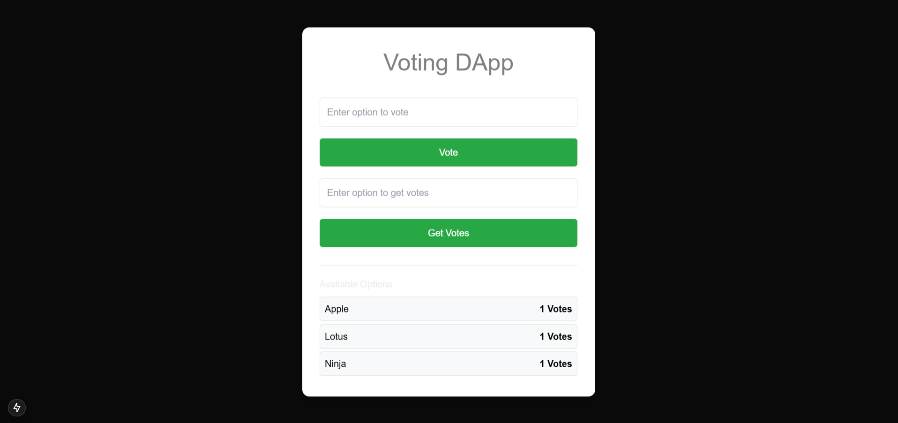
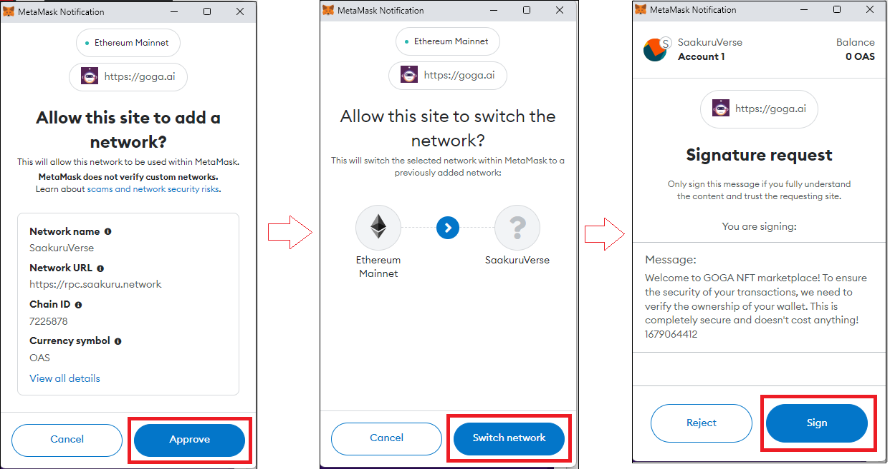
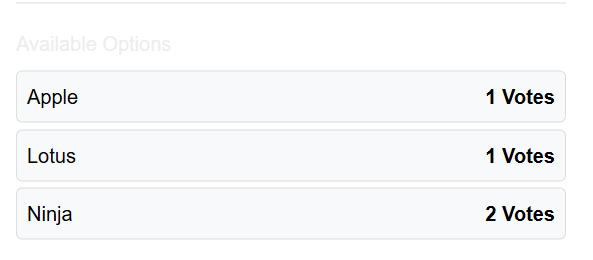
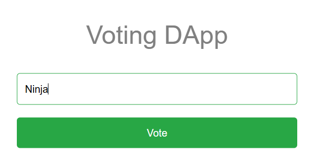
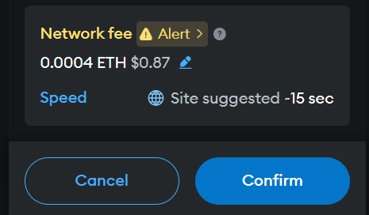
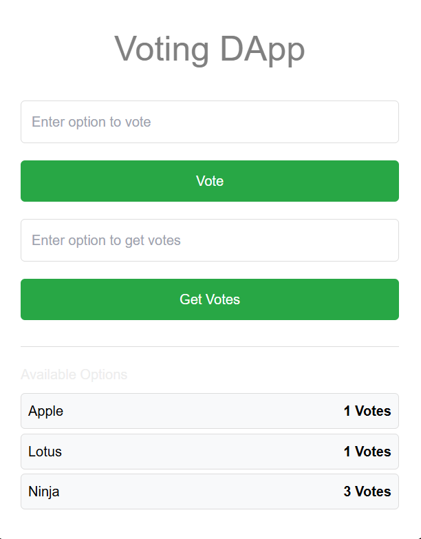

# Voting DApp Documentation

## Project Overview

The **Voting DApp** (Decentralized Application) is a blockchain-based voting platform that allows users to cast votes on various options securely and transparently. The application utilizes smart contracts to manage the voting process, ensuring that votes are immutable and verifiable.

## Purpose of the Project

### What Is the Need?

In traditional voting systems, issues such as fraud, manipulation, and lack of transparency often arise. The need for a secure, transparent, and tamper-proof voting mechanism led to the development of this Voting DApp. It aims to provide:

- **Security**: Protects votes from tampering.
- **Transparency**: Allows anyone to verify results.
- **Accessibility**: Enables users to vote from anywhere with an internet connection.

### Why Use Blockchain?

Blockchain technology is employed for the following reasons:

- **Decentralization**: No single entity controls the voting process, reducing the risk of manipulation.
- **Immutability**: Once a vote is cast, it cannot be changed or deleted, ensuring the integrity of the voting process.
- **Transparency**: All transactions are recorded on a public ledger, allowing anyone to audit the votes.

## Key Features

- **User-Friendly Interface**: The application is designed for ease of use, allowing users to vote with minimal effort.
- **Real-Time Vote Count**: Users can see the current vote counts for each option.
- **Validation**: Users can check if an option is valid for voting before casting their votes.

## Challenges

- **User Adoption**: Getting users familiar with blockchain technology and encouraging them to adopt the DApp can be difficult.
- **Technical Complexity**: Understanding smart contracts and blockchain principles may pose challenges for beginners.
- **Gas Fees**: Depending on the blockchain network, users may incur transaction fees (gas fees) when voting, which can deter participation.

## Benefits

- **Increased Trust**: Users can trust that their votes are counted accurately due to the transparent nature of blockchain.
- **Reduced Costs**: Once established, a blockchain voting system can reduce costs associated with traditional voting methods, such as printing ballots and staffing polling places.
- **Scalability**: The DApp can handle a large number of users and votes simultaneously without performance degradation.

## Getting Started

To use the Voting DApp, follow these simple steps:

### Step 1: Install MetaMask

- Install the MetaMask browser extension from the official website.

### Step 2: Create or Import a Wallet

- Set up a new wallet or import an existing one by following the on-screen instructions.

### Step 3: Connect Your Wallet

- Open the Voting DApp in your browser and connect your MetaMask wallet by clicking on the "Connect Wallet" button.

### Step 4: Select an Option to Vote

- Browse the available voting options presented in the DApp interface.

### Step 5: Cast Your Vote

- Enter your desired option in the input box and click the "Vote" button to submit your vote.

### Step 6: Confirmation

- After voting, you will receive a confirmation alert indicating your vote has been cast successfully.

## Conclusion

The Voting DApp leverages blockchain technology to create a secure, transparent, and user-friendly voting experience. It addresses the shortcomings of traditional voting systems while empowering users with a reliable platform to express their opinions.

By understanding the basic concepts of blockchain and decentralized applications, beginners can appreciate the innovative approach to voting that this project represents.
